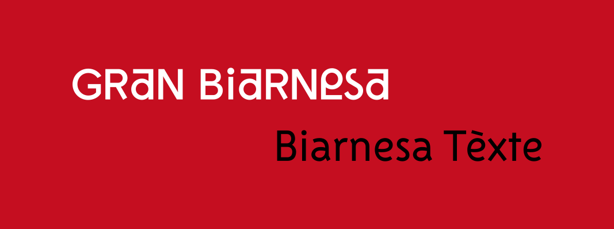
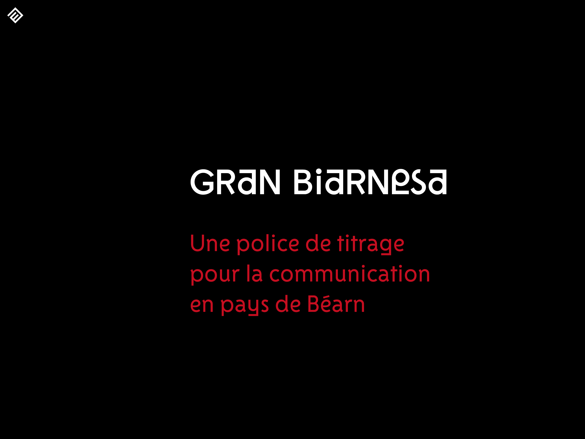
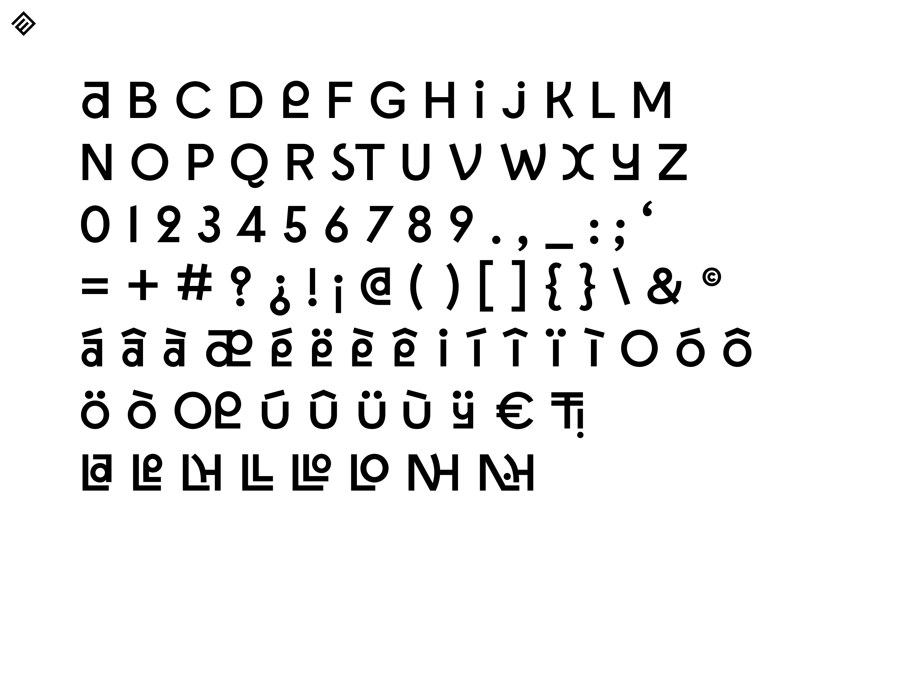
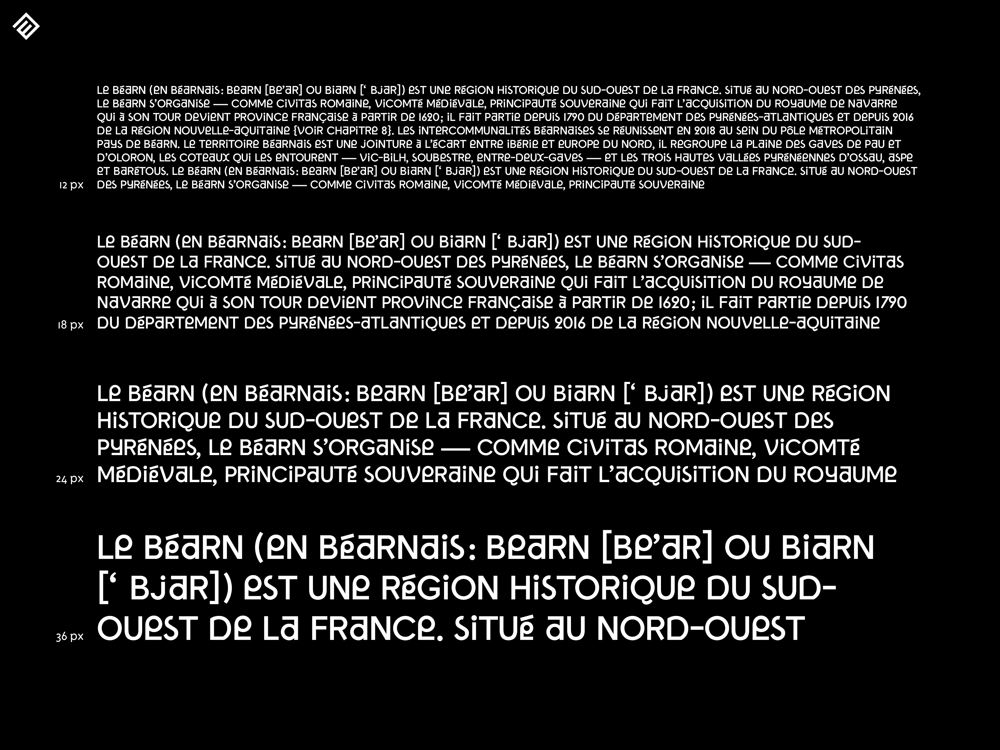
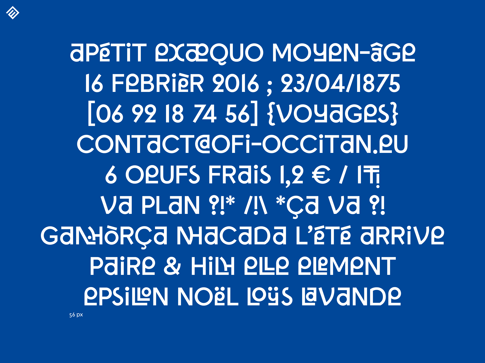
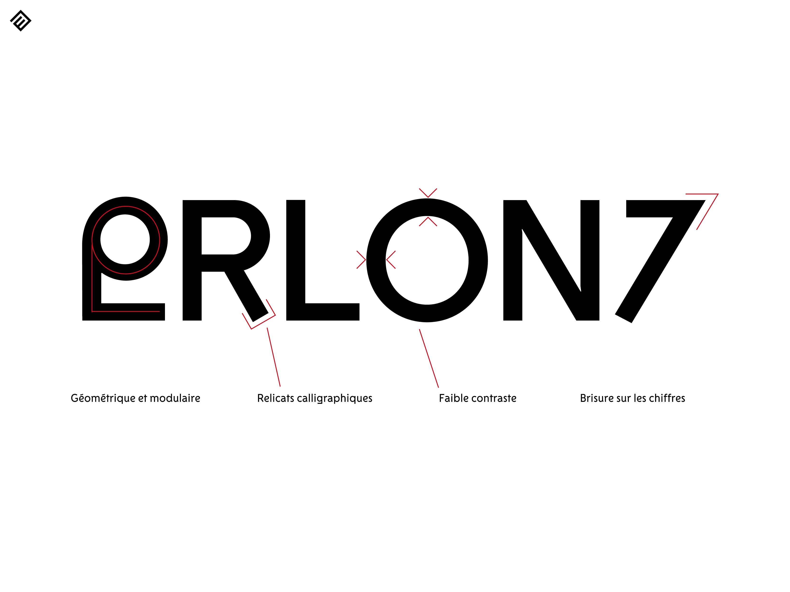
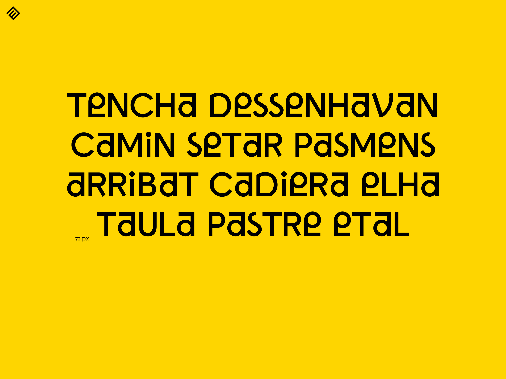
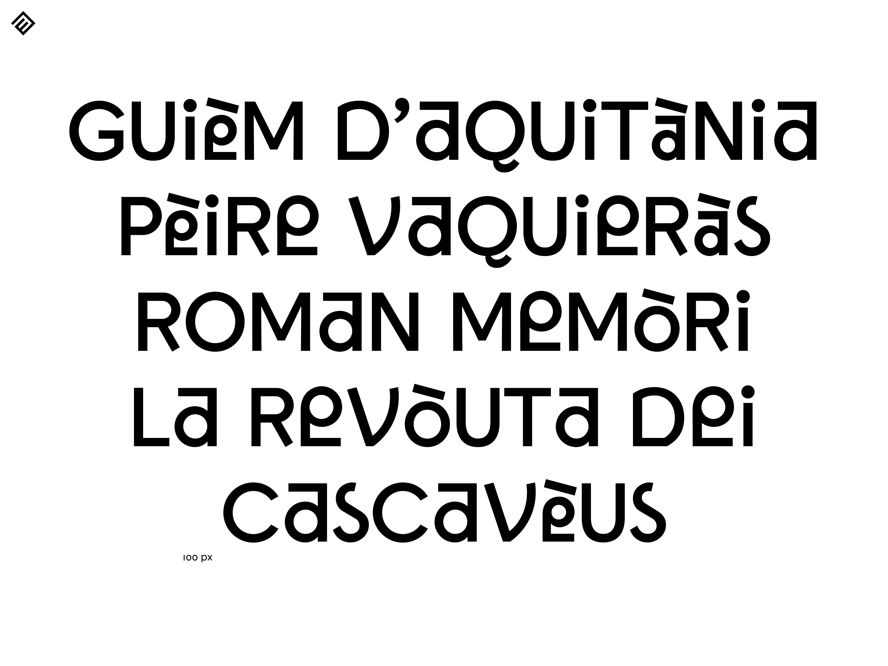
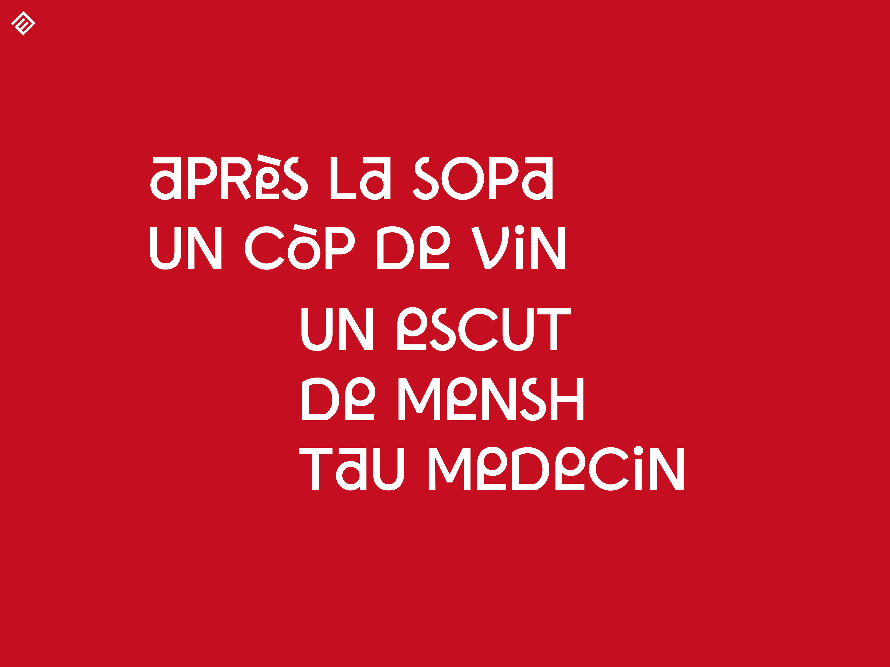

# Gran Biarnesa

Un caractère typographique aux accents béarnais dessiné, conçu et développé par [Ivan Bléhaut](https://atelierzud.net/) et [Léo Gaullier](https://leogaullier.fr) dans le cadre d’une commande à la [Maison des éditions](https://maisondeseditions.fr) par le [Pays de Béarn](https://pays-de-bearn.fr).

Le caractère est décliné selon deux approches : Gran Biarnesa, pour le titrage et [Biarnesa tèxte](https://github.com/maisondeseditions/biarnesa-texte).

 

 

 

 

 

 

 

 

 

## Licence

Le caractère est distribué sous licence libre [SIL Open Font Licence](LICENCE).